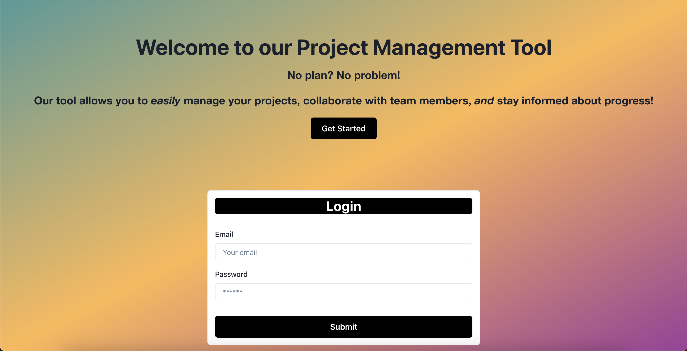

# NoPMS (Project Management System)

## Table of Contents

- [Description](#description)
- [Installation](#installation)
- [Usage](#usage)
- [License](#license)
- [Acknowledgements](#acknowledgements)

## Description
This project management tool makes managing and organizing your GitHub projects very simple. Also, the user has the ability to collaborate with team members and stay up to date with any progress that has been made!

To view the live site [click here]().

## Installation
Run `npm i` to install all dependencies and packages.

## Usage
To begin, the user will be prompted with a login page. If the user has not created an account, click the "Get Started" or "Signup" button. After creating an account or logging in, the user will be prompted with the "Projects Page". If a project has already been created, this is where the project card will be displayed. The user will have the option to view the project in more detail, or even delete the project. When viewing the project, the user will have the option to view messages specifically for this project or even create one. The user can also add collaborators. To create a project, navigate to "Create Project". Then, fill out the prompts.  

## License 

## Acknowledgements
Created by Alejandra Miret, Christopher Doolhoff, George Karamanis, Jonathan Perez, and Nicholas Miller